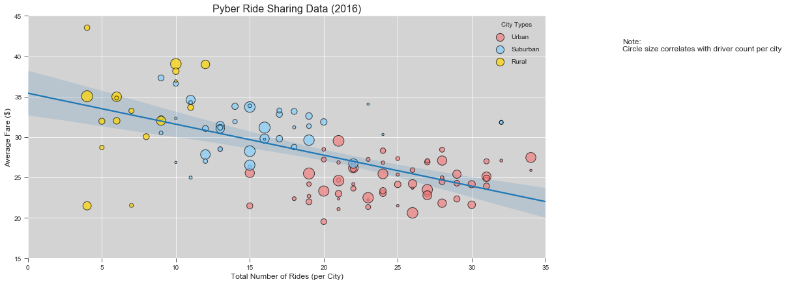
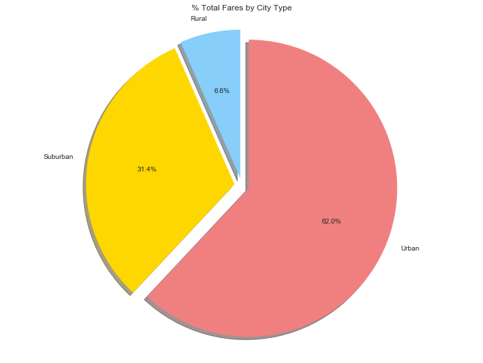
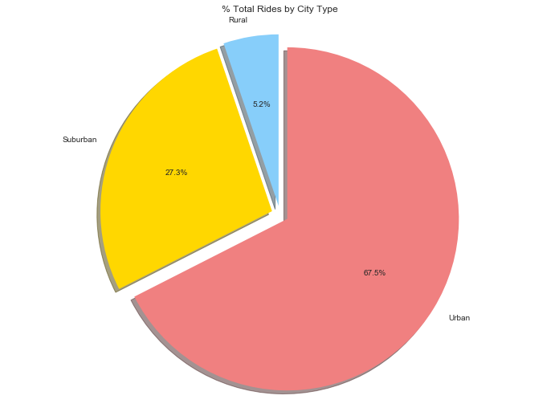
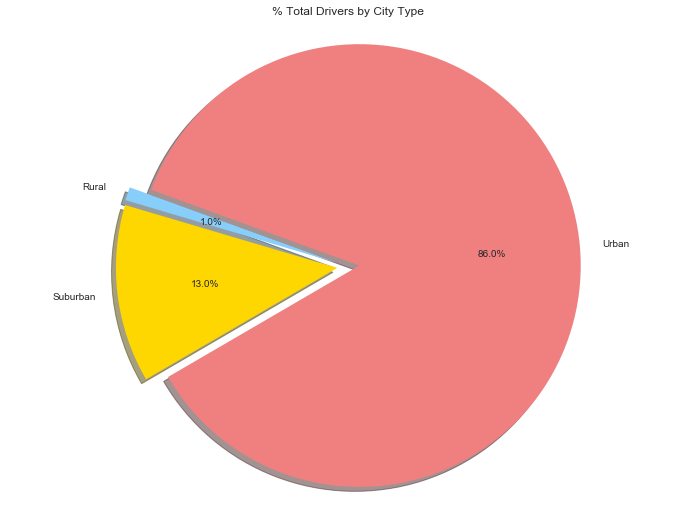

# Pyber Ride Sharing

## Analysis

## Observed Trend 1

Rural cities seem to have higher average fares than both urban and suburban cities. The data potentially shows a relationship between total fares in a city and the average fare, more rides tend to mean a lower overall average fare.  
## Observed Trend 2
Urban cities dominate the total fare, total rides and total driver statistics. Although rural drivers make up only 1% of drivers, they raise 6.6% of fares. 
## Observed Trend 3
There are still many cities with high ride counts that have relatively few drivers and could represent an opportunity for business expansion. 

```python
import pandas as pd
import matplotlib.pyplot as plt
import numpy as np
import seaborn as sns
```


```python
city_df = pd.read_csv('raw_data/city_data.csv')
ride_df = pd.read_csv('raw_data/ride_data.csv')
```


```python
display(city_df.head()) 
display(ride_df.head())
```


<div>
<style>
    .dataframe thead tr:only-child th {
        text-align: right;
    }

    .dataframe thead th {
        text-align: left;
    }

    .dataframe tbody tr th {
        vertical-align: top;
    }
</style>
<table border="1" class="dataframe">
  <thead>
    <tr style="text-align: right;">
      <th></th>
      <th>city</th>
      <th>driver_count</th>
      <th>type</th>
    </tr>
  </thead>
  <tbody>
    <tr>
      <th>0</th>
      <td>Kelseyland</td>
      <td>63</td>
      <td>Urban</td>
    </tr>
    <tr>
      <th>1</th>
      <td>Nguyenbury</td>
      <td>8</td>
      <td>Urban</td>
    </tr>
    <tr>
      <th>2</th>
      <td>East Douglas</td>
      <td>12</td>
      <td>Urban</td>
    </tr>
    <tr>
      <th>3</th>
      <td>West Dawnfurt</td>
      <td>34</td>
      <td>Urban</td>
    </tr>
    <tr>
      <th>4</th>
      <td>Rodriguezburgh</td>
      <td>52</td>
      <td>Urban</td>
    </tr>
  </tbody>
</table>
</div>


<div>
<style>
    .dataframe thead tr:only-child th {
        text-align: right;
    }

    .dataframe thead th {
        text-align: left;
    }

    .dataframe tbody tr th {
        vertical-align: top;
    }
</style>
<table border="1" class="dataframe">
  <thead>
    <tr style="text-align: right;">
      <th></th>
      <th>city</th>
      <th>date</th>
      <th>fare</th>
      <th>ride_id</th>
    </tr>
  </thead>
  <tbody>
    <tr>
      <th>0</th>
      <td>Sarabury</td>
      <td>2016-01-16 13:49:27</td>
      <td>38.35</td>
      <td>5403689035038</td>
    </tr>
    <tr>
      <th>1</th>
      <td>South Roy</td>
      <td>2016-01-02 18:42:34</td>
      <td>17.49</td>
      <td>4036272335942</td>
    </tr>
    <tr>
      <th>2</th>
      <td>Wiseborough</td>
      <td>2016-01-21 17:35:29</td>
      <td>44.18</td>
      <td>3645042422587</td>
    </tr>
    <tr>
      <th>3</th>
      <td>Spencertown</td>
      <td>2016-07-31 14:53:22</td>
      <td>6.87</td>
      <td>2242596575892</td>
    </tr>
    <tr>
      <th>4</th>
      <td>Nguyenbury</td>
      <td>2016-07-09 04:42:44</td>
      <td>6.28</td>
      <td>1543057793673</td>
    </tr>
  </tbody>
</table>
</div>


```python
merger = ride_df.merge(city_df, on='city')
merger.tail()
```


<div>
<style>
    .dataframe thead tr:only-child th {
        text-align: right;
    }

    .dataframe thead th {
        text-align: left;
    }

    .dataframe tbody tr th {
        vertical-align: top;
    }
</style>
<table border="1" class="dataframe">
  <thead>
    <tr style="text-align: right;">
      <th></th>
      <th>city</th>
      <th>date</th>
      <th>fare</th>
      <th>ride_id</th>
      <th>driver_count</th>
      <th>type</th>
    </tr>
  </thead>
  <tbody>
    <tr>
      <th>2402</th>
      <td>South Elizabethmouth</td>
      <td>2016-04-21 10:20:09</td>
      <td>16.50</td>
      <td>5702608059064</td>
      <td>3</td>
      <td>Rural</td>
    </tr>
    <tr>
      <th>2403</th>
      <td>Matthewside</td>
      <td>2016-02-23 17:46:29</td>
      <td>59.65</td>
      <td>241191157535</td>
      <td>4</td>
      <td>Rural</td>
    </tr>
    <tr>
      <th>2404</th>
      <td>Matthewside</td>
      <td>2016-02-23 00:43:51</td>
      <td>40.84</td>
      <td>8665248512368</td>
      <td>4</td>
      <td>Rural</td>
    </tr>
    <tr>
      <th>2405</th>
      <td>Matthewside</td>
      <td>2016-05-18 02:00:30</td>
      <td>48.67</td>
      <td>2049161404256</td>
      <td>4</td>
      <td>Rural</td>
    </tr>
    <tr>
      <th>2406</th>
      <td>Matthewside</td>
      <td>2016-08-08 14:02:35</td>
      <td>24.97</td>
      <td>2872494724827</td>
      <td>4</td>
      <td>Rural</td>
    </tr>
  </tbody>
</table>
</div>


## Bubble Plot of Ride Sharing Data


```python
bubble_pivot = pd.pivot_table(merger
                              ,index=['city','type','driver_count']
                              ,values = ['fare','ride_id']
                              ,aggfunc={'fare':np.mean, 'ride_id':len})
bubble_df = pd.DataFrame(bubble_pivot.to_records())
bubble_df.head()
```


<div>
<style>
    .dataframe thead tr:only-child th {
        text-align: right;
    }

    .dataframe thead th {
        text-align: left;
    }

    .dataframe tbody tr th {
        vertical-align: top;
    }
</style>
<table border="1" class="dataframe">
  <thead>
    <tr style="text-align: right;">
      <th></th>
      <th>city</th>
      <th>type</th>
      <th>driver_count</th>
      <th>fare</th>
      <th>ride_id</th>
    </tr>
  </thead>
  <tbody>
    <tr>
      <th>0</th>
      <td>Alvarezhaven</td>
      <td>Urban</td>
      <td>21</td>
      <td>23.928710</td>
      <td>31</td>
    </tr>
    <tr>
      <th>1</th>
      <td>Alyssaberg</td>
      <td>Urban</td>
      <td>67</td>
      <td>20.609615</td>
      <td>26</td>
    </tr>
    <tr>
      <th>2</th>
      <td>Anitamouth</td>
      <td>Suburban</td>
      <td>16</td>
      <td>37.315556</td>
      <td>9</td>
    </tr>
    <tr>
      <th>3</th>
      <td>Antoniomouth</td>
      <td>Urban</td>
      <td>21</td>
      <td>23.625000</td>
      <td>22</td>
    </tr>
    <tr>
      <th>4</th>
      <td>Aprilchester</td>
      <td>Urban</td>
      <td>49</td>
      <td>21.981579</td>
      <td>19</td>
    </tr>
  </tbody>
</table>
</div>


```python
plt.clf()

markersizer = 4

sns.lmplot(x='ride_id', y='fare', data=bubble_df,scatter=False, size=6, aspect=2)

plt.scatter(x= bubble_df['ride_id'][bubble_df['type'] == 'Urban']
            ,y = bubble_df['fare'][bubble_df['type'] == 'Urban']
            ,c = 'lightcoral'
            ,s = bubble_df['driver_count'] * markersizer
            ,linewidths=1
            ,edgecolor='black'
            ,label='Urban'
            ,marker='o'
            ,alpha = .7
             )
plt.scatter(x= bubble_df['ride_id'][bubble_df['type'] == 'Suburban']
            ,y = bubble_df['fare'][bubble_df['type'] == 'Suburban']
            ,c = 'lightskyblue'
            ,s = bubble_df['driver_count'] * markersizer
            ,linewidths=1
            ,edgecolor='black'
            ,label='Suburban'
            ,marker='o'
            ,alpha = .7
             )
plt.scatter( x = bubble_df['ride_id'][bubble_df['type'] == 'Rural']
            ,y = bubble_df['fare'][bubble_df['type'] == 'Rural']
            ,c = 'gold'
            ,s = bubble_df['driver_count'] * markersizer
            ,linewidths=1
            ,edgecolor='black'
            ,label='Rural'
            ,marker='o'
            ,alpha = .7
             )
```


    <matplotlib.collections.PathCollection at 0x233bf5ec630>


```python
fig_size = plt.rcParams["figure.figsize"]
 
# Prints: [8.0, 6.0]
print("Current size:", fig_size)
 
# Set figure width to 12 and height to 9
fig_size[0] = 12
fig_size[1] = 9
plt.rcParams["figure.figsize"] = fig_size
```

    Current size: [12.0, 9.0]
    


```python
plt.title('Pyber Ride Sharing Data (2016)', fontsize=16)
plt.ylabel('Average Fare ($)', fontsize=12)
plt.xlabel('Total Number of Rides (per City)', fontsize=12)
plt.xlim(0,35)
plt.ylim(15,45)
plt.legend(title = 'City Types', loc='upper right',framealpha=0,labelspacing=1)
plt.text(40.2,40.65,'Note:\nCircle size correlates with driver count per city', fontsize=12)
plt.grid(alpha = .95,color= 'white')
plt.gca().set_facecolor('lightgray')
plt.gca().spines['top'].set_visible(False)
plt.gca().spines['right'].set_visible(False)
plt.gca().spines['bottom'].set_visible(False)
plt.gca().spines['left'].set_visible(False)
plt.show()
```


    <matplotlib.figure.Figure at 0x233bf414da0>





## Total Fares by City Type


```python
merger_fare_groupby = merger.groupby('type').sum()
merger_fare_groupby['fare']
```


    type
    Rural        4255.09
    Suburban    20335.69
    Urban       40078.34
    Name: fare, dtype: float64


```python
plt.pie(merger_fare_groupby['fare']
        ,explode = (0.05,0.05,0.05)
        ,labels = merger_fare_groupby['fare'].keys()
        ,colors = ["lightskyblue","gold","lightcoral"]
        ,autopct ="%1.1f%%"
        ,shadow = True
        ,startangle = 90)
plt.title("% Total Fares by City Type")
plt.axis("equal")
plt.show()
```





## Total Rides by City Type


```python
merger_rides_groupby = merger.groupby('type').count()
merger_rides_groupby['ride_id']
```


    type
    Rural        125
    Suburban     657
    Urban       1625
    Name: ride_id, dtype: int64


```python
plt.pie(merger_rides_groupby['city']
        ,explode= (0.05,0.05,0.05)
        ,labels = merger_rides_groupby['city'].keys()
        ,colors = ["lightskyblue","gold","lightcoral"]
        ,autopct = "%1.1f%%"
        ,shadow = True
        ,startangle = 90)
plt.title("% Total Rides by City Type")
plt.axis("equal")
plt.show()
```





## Total Drivers by City Type


```python
merger_drivers_groupby = merger.groupby('type').sum()
merger_drivers_groupby['driver_count']
```


    type
    Rural         727
    Suburban     9730
    Urban       64501
    Name: driver_count, dtype: int64


```python
plt.pie(merger_drivers_groupby['driver_count']
        ,explode= (0.05,0.05,0.05)
        ,labels = merger_drivers_groupby['driver_count'].keys()
        ,colors = ["lightskyblue","gold","lightcoral"],
        autopct = "%1.1f%%"
        ,shadow=True
        ,startangle=160)
plt.title("% Total Drivers by City Type")
plt.axis("equal")
plt.show()
```




